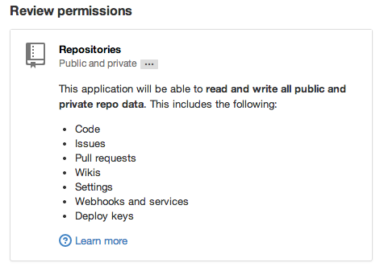

# Autorisation distribuée avec des macarons

------------------------------------------------------------------

# Identité, authentification, et autorisation

------------------------------------------------------------------

## Identité

### Qui suis-je ? (Qui je prétends être ?)

<pre style="font-size: 0.8em;" id="irc"></pre>

------------------------------------------------------------------

## Authentification

### Suis-je réellement celui que je prétends être ?

- Password

- OTP

- ~~Biométrie~~

------------------------------------------------------------------

## Autorisation

### Qu'ai-je le droit de faire ?

------------------------------------------------------------------

## Moyens d'autorisation

- tokens OAuth
- assertions SAML/OpenID
- URLs non listées

------------------------------------------------------------------

## OAuth

- [OAuth 2.0 - The Good, The Bad & The Ugly](http://code.tutsplus.com/articles/oauth-20-the-good-the-bad-the-ugly--net-33216)

- [OAuth 2.0 and the Road to Hell](http://hueniverse.com/2012/07/26/oauth-2-0-and-the-road-to-hell/)

### Fun fact

L'auteur principal de OAuth 2.0, Eran Hammer, s'est retiré du projet et a demandé à ce que son nom soit supprimé de la spec.

------------------------------------------------------------------

------------------------------------------------------------------

## Anatomie

### Privé

- secret : nonce

### Public

- identifier : lien vers le secret

- location : URL

- signature : $HMAC(secret,identifier)$

------------------------------------------------------------------

## Exemple

~~~{.haskell .nowrap .small}
> let m = create "random secret key"
                 "we used our secret"
                 "http://filecloud.com"
> inspect m
location "http://filecloud.com"
identifier "we used our secret"

signature "ACD99D7B0A278FB85657E9E4972F4BF69C78A1FBFE748FBBABCBA46EC0BED397"
~~~

------------------------------------------------------------------

## Macaron nu

- Permissif

- Root token

### Restriction d'un macaron

- Caveats

------------------------------------------------------------------

## Caveats

### Restriction d'un macaron par ajout de propriétés/contraintes.

- time < 
- account = 1234567
- path startsWith "public/"
- ...

### Deux types

- First party
- Third party

------------------------------------------------------------------

## Exemple

~~~{.haskell .nowrap .small}
> secret m
"ACD99D7B0A278FB85657E9E4972F4BF69C78A1FBFE748FBBABCBA46EC0BED397"

> let m'= addFirstPartyCaveat "account = alice" m
> inspect m'
location "http://filecloud.com"
identifier "we used our secret"
cid "account = alice"
signature "48D0DA8B1191F503434EF9D01ECE5140F31C5AA3FD525E69DBCFC8CB34D59FD4"

> let m'' = addFirstPartyCaveat "account = bob" m
> inspect m''
location "http://filecloud.com"
identifier "we used our secret"
cid "account = bob"
signature "A729B1C69979EB4D40B04674C3E698D32FEB1DD0C88C0BC311EDC0B5258D3E49"
~~~

------------------------------------------------------------------

## Signatures

- Initial Macaron : `sig = HMAC(secret,identifier)`
- Pour chaque caveat : `sig' = HMAC(sig,cid)`

### HMAC chainés

- L'ordre est important
- On ne peut pas retirer un caveat (non-inversibilité de HMAC)
- On peut en ajouter sans nécessité de connaitre le secret

------------------------------------------------------------------

## First party vs Third party

### First party

- cid : assertion

### Third party

#### Privé

Partagé entre nous et le service tiers

- caveat_key : secret
- assertion

#### Public

- cl : Identifiant/url du service tiers
- cid : identifiant permettant de retrouver (caveat_key,assertion)
- vid : `encrypt(sig,caveat_key)`

------------------------------------------------------------------

## Vérification d'un macaron `M`

- Signature : La chaine de signatures est respectée
- Caveats
    - First party : fonction `verify(cid)`
    - Third party :
        1. Le tiers fournit un macaron de décharge `D = macaron@(cl,caveat_key, identifier)`
        2. Le macaron `D` est lié à `M`: `D' = bind(D,M)`
        3. `M` est envoyé avec `D'`
        4. Le caveat est vérifié avec les décharges

------------------------------------------------------------------

## Implémentations

- C : <https://github.com/rescrv/libmacaroons> (+ bindings python/go)
- Java : <https://github.com/nitram509/jmacaroons>
- Haskell : <https://github.com/jtanguy/hmacaroons>
- Node.js : <https://github.com/nitram509/macaroons.js>
- Python : <https://github.com/ecordell/pymacaroons>
- Rust : <https://github.com/cryptosphere/rust-macaroons.git>

------------------------------------------------------------------

## Bonus: Lecture

- [Google paper on macaroons](http://research.google.com/pubs/pub41892.html)
- [Macaroons at Mozilla](https://air.mozilla.org/macaroons-cookies-with-contextual-caveats-for-decentralized-authorization-in-the-cloud/)
- [Time for better security in NoSQL](http://hackingdistributed.com/2014/11/23/macaroons-in-hyperdex/)
- [Google's Macaroons in five minutes or less](http://blog.bren2010.io/2014/12/04/macaroons.html)
- [Macaroons 101: Contextual Confinement](http://evancordell.com/2015/09/27/macaroons-101-contextual-confinement.html)
